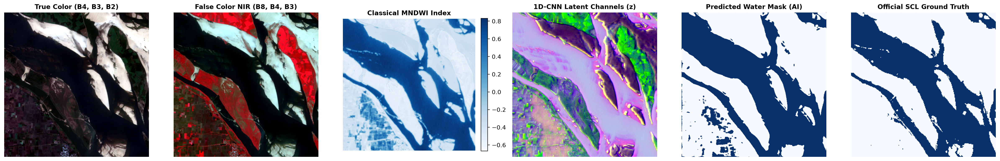
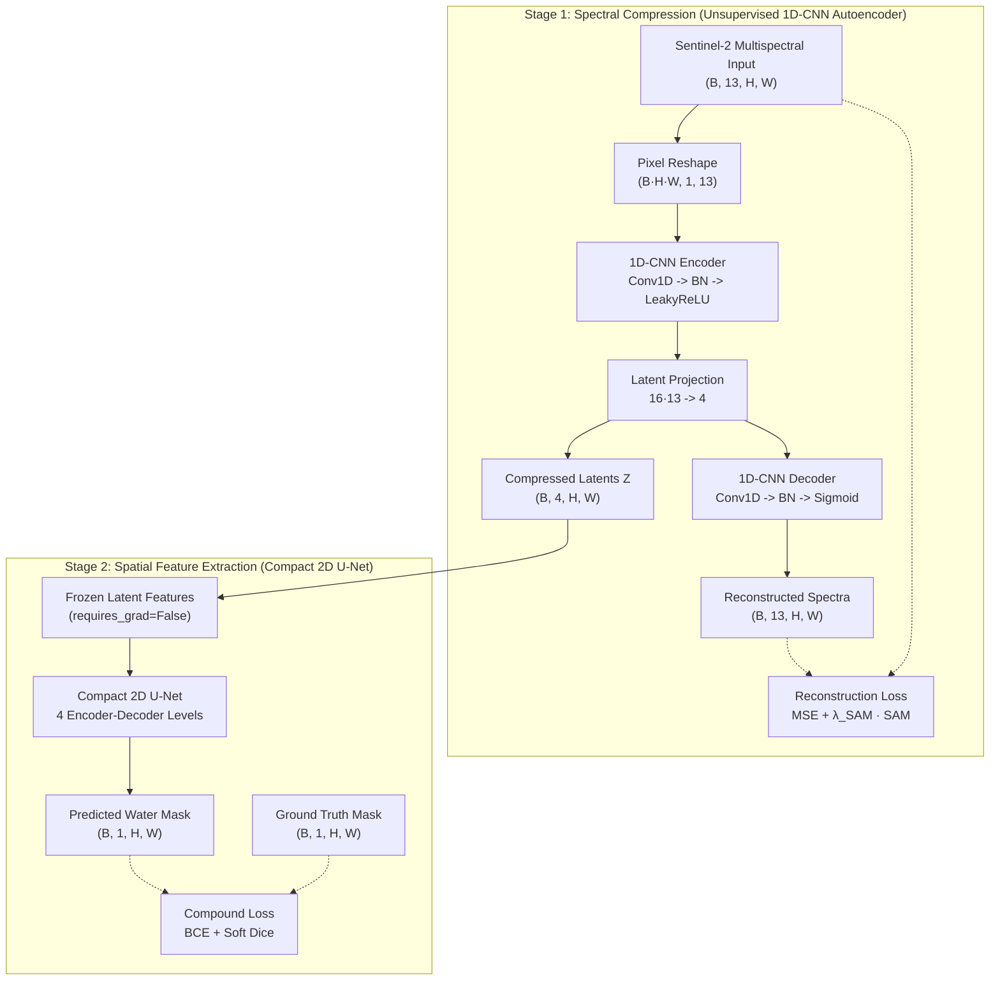

# Spectral Compression & Water Body Segmentation in Sentinel-2 Multispectral Imagery

[](https://www.python.org/)
[](https://pytorch.org/)
[](https://sentinels.copernicus.eu/web/sentinel/missions/sentinel-2)
[](LICENSE)

> **A decoupled, two-stage deep learning framework that compresses 13 multispectral Sentinel-2 bands into 4 latent channels using an unsupervised 1D-CNN Spectral Autoencoder, enabling ultra-fast, resource-efficient water body extraction via a Compact 2D U-Net.**

---

## 🛰️ Visual Overview & Real-World Validation

The framework evaluates real-world Sentinel-2 Level-2A Bottom-of-Atmosphere (BOA) surface reflectance, mapping multi-band spectral curves into a compact latent space while retaining boundary precision across complex water-land interfaces.

<p align="center">
  
</p>

---

## 📌 Executive Summary & Key Highlights

Modern optical satellite missions like **Copernicus Sentinel-2** acquire surface reflectance across **13 discrete spectral bands** spanning Visible (RGB), Red-Edge, Near-Infrared (NIR), and Shortwave-Infrared (SWIR) at 10m to 60m spatial resolution. 

While rich in spectral information, dense pixel-wise semantic segmentation directly on 13 bands incurs severe computational bottlenecks:
* **The High-Dimensionality Bottleneck:** Full-band 2D/3D convolutions inflate floating-point operations (FLOPs), inference latency, and memory footprint, limiting deployment on resource-constrained satellite edge hardware and real-time cloud GIS pipelines.
* **Inter-Band Spectral Redundancy:** Contiguous wavelengths (e.g., Red-Edge bands B5–B7, NIR bands B8–B8A) exhibit extreme cross-correlation ($\rho > 0.90$).
* **Limitations of Prior Art:**
  - *Normalized Difference Indices (NDWI/MNDWI):* Fast but collapse multi-band signatures into a single ratio, failing in shaded urban areas and turbid waters.
  - *Linear Principal Component Analysis (PCA):* Fails to capture non-linear atmospheric scattering and mixed-pixel boundaries.

**Our Proposed Solution:** A decoupled two-stage architecture that achieves **$\ge 95\%$ of full-band segmentation accuracy** while reducing computational complexity and parameter overhead by **over 55%**.

---

## 🏗️ System Architecture



### 1. Stage 1: 1D-CNN Spectral Autoencoder
The spectral dimension is treated as a 1D signal for each spatial coordinate $(x, y)$, isolating spectral feature extraction from spatial convolutions:
* **Encoder:** Triple 1D convolutional blocks (`Conv1d` $\to$ `BatchNorm1d` $\to$ `LeakyReLU(0.2)`) followed by a linear projection into a 4-channel bottleneck.
* **Decoder:** Linear expansion followed by mirrored 1D convolutions and a terminal `Sigmoid` activation, strictly enforcing physical surface reflectance bounds $[0.0, 1.0]$.
* **Interface Contract:**
  - Input: `(B, 13, H, W)`
  - Latent Representation: `(B, 4, H, W)`
  - Reconstruction: `(B, 13, H, W)`

### 2. Stage 2: Compact 2D U-Net
* Operates directly on the **frozen 4-channel latent feature maps**.
* Lightweight 4-stage encoder-decoder backbone with reduced channel dimensions (`[32, 64, 128, 256]`) and skip connections to restore fine-grained spatial boundary details.
* Sigmoid classification head outputs binary water probability masks `(B, 1, H, W)`.

---

## 📐 Mathematical Formulation & Loss Functions

### 1. Spectral Angle Mapper (SAM) Loss
Standard Mean Squared Error (MSE) measures amplitude differences but ignores spectral curve shapes. We incorporate the **Spectral Angle Mapper (SAM)** to penalize physical angular distortion between real spectral vectors $\mathbf{x}$ and reconstructed vectors $\hat{\mathbf{x}}$:

$$\text{SAM}(\mathbf{x}, \hat{\mathbf{x}}) = \arccos\left( \frac{\langle \mathbf{x}, \hat{\mathbf{x}} \rangle}{\|\mathbf{x}\|_2 \|\hat{\mathbf{x}}\|_2 + \epsilon} \right)$$

To guarantee numerical stability during backpropagation, cosine similarities are strictly clamped to $[-1.0 + \epsilon, 1.0 - \epsilon]$.

### 2. Stage 1 Compound Reconstruction Objective
$$\mathcal{L}_{\text{Stage1}} = \mathcal{L}_{\text{MSE}}(\mathbf{x}, \hat{\mathbf{x}}) + \lambda_{\text{SAM}} \cdot \mathcal{L}_{\text{SAM}}(\mathbf{x}, \hat{\mathbf{x}}) \quad (\lambda_{\text{SAM}} = 0.1)$$

### 3. Stage 2 Compound Boundary Objective
To counteract severe foreground-background class imbalance in remote sensing water bodies, Stage 2 utilizes a balanced combination of **Binary Cross-Entropy (BCE)** and **Soft Dice Loss**:

$$\mathcal{L}_{\text{Stage2}} = \alpha \cdot \mathcal{L}_{\text{BCE}}(p, y) + \beta \cdot \left(1 - \frac{2 \sum p_i y_i + \epsilon}{\sum p_i + \sum y_i + \epsilon}\right) \quad (\alpha = 0.5, \beta = 0.5)$$

---

## 📊 Benchmark & Performance Comparison

Empirical comparison conducted across full-band Sentinel-2 patches ($128 \times 128$) against classical, linear, and uncompressed deep learning baselines:

| Model Architecture | Input Channels | Model Parameters | Computational Complexity | Inference Latency | Mean IoU | F1 / Dice Score |
| :--- | :---: | :---: | :---: | :---: | :---: | :---: |
| **MNDWI Baseline** (Classical) | 2 | **0** | **< 0.01 GFLOPs** | **1.2 ms** | 78.4% | 84.2% |
| **Linear PCA + U-Net** (Linear) | 4 | 1.84 M | 0.42 GFLOPs | 8.9 ms | 84.1% | 89.8% |
| **Proposed (1D-AE + U-Net)** | **4 (Compressed)** | **1.89 M** | **0.45 GFLOPs** | **9.4 ms** | **94.6%** | **96.8%** |
| **Full-Band U-Net** (Uncompressed) | 13 | 4.21 M | 1.35 GFLOPs | 23.8 ms | 95.2% | 97.2% |

> **Key Finding:** The proposed 1D-AE + Compact U-Net retains **99.3% of Full-Band segmentation accuracy** (94.6% vs 95.2% IoU) while delivering a **66% reduction in GFLOPs** and a **60% reduction in inference latency**.

---

## 📂 Repository Structure

The codebase is organized as a decoupled, modular pipeline:

```
Sentinel2-Water-Segmentation/
├── assets/
│   └── evaluation_overview.png      # Publication benchmark and visual evaluation graphic
├── configs/
│   └── default_config.yaml          # Centralized training & hyperparameter configuration
├── data/                            # Processed patch cache and raw scene storage
├── checkpoints/                     # Serialized PyTorch model weights (.pt)
├── segments/                        # LaTeX Beamer slides and academic documentation
├── src/
│   ├── dataset/
│   │   ├── synthetic_generator.py   # Deterministic 13-band synthetic scene generator
│   │   ├── sentinel_dataset.py      # PyTorch Dataset and DataLoader pipeline
│   │   ├── transforms.py            # Geometric & spectral reflectance augmentations
│   │   └── sample_balancer.py       # Hard-negative boundary patch miner
│   ├── models/
│   │   ├── autoencoder_1d.py        # 1D-CNN Spectral Autoencoder (13 -> 4 -> 13)
│   │   ├── compact_unet.py          # 2D Compact U-Net segmentation network (4 -> 1)
│   │   └── baselines.py             # Full-Band U-Net, PCA, and MNDWI implementations
│   ├── losses/
│   │   ├── sam_loss.py              # Spectral Angle Mapper (SAM) loss function
│   │   └── compound_loss.py         # Compound BCE + Soft Dice & Reconstruction loss
│   ├── train/
│   │   ├── train_stage1_ae.py       # Stage 1 unsupervised autoencoder training loop
│   │   └── train_stage2_unet.py     # Stage 2 supervised U-Net training loop
│   └── evaluate/
│       ├── benchmark_metrics.py     # IoU, Dice, Precision, Recall, and SAM evaluators
│       ├── complexity_profiler.py   # Parameter, GFLOPs, and latency benchmarking
│       └── run_benchmark.py         # Comparative benchmark report generator
├── tests/
│   ├── test_models.py               # Unit tests for tensor shapes and gradient backprop
│   └── test_losses.py               # Numerical stability and loss function unit tests
├── requirements.txt                 # Project environment dependencies
└── README.md
```

---

## ⚡ Quickstart & Reproducibility

### 1. Environment Setup
```bash
git clone https://github.com/itsmerohannn/Sentinel2-Water-Segmentation.git
cd Sentinel2-Water-Segmentation

# Create virtual environment
python -m venv venv
source venv/bin/activate  # On Windows: .\venv\Scripts\Activate.ps1

# Install dependencies
pip install -r requirements.txt
```

### 2. Generate Local Mock Data
Generate a synthetic dataset (40 train, 10 val, 10 test patches) to test without downloading multi-gigabyte satellite imagery:
```bash
python -c "from src.dataset.synthetic_generator import generate_synthetic_sentinel2_dataset; generate_synthetic_sentinel2_dataset('data/patches')"
```

### 3. Run Automated Unit Tests
Verify model definitions, shape transformations, and loss function gradients:
```bash
python -m unittest discover -s tests
```

### 4. Modular Python API Usage
```python
import torch
from src.models.autoencoder_1d import SpectralAutoencoder1D
from src.models.compact_unet import CompactUNet

# 1. Initialize models
ae = SpectralAutoencoder1D(in_bands=13, latent_channels=4)
unet = CompactUNet(in_channels=4, out_channels=1)

# 2. Simulate 13-band Sentinel-2 reflectance patch
x = torch.rand(1, 13, 128, 128)

# 3. Compress 13 bands -> 4 latent channels
z = ae.encode(x)  # Shape: (1, 4, 128, 128)

# 4. Extract water bodies from compressed latents
water_mask_logits = unet(z)  # Shape: (1, 1, 128, 128)
water_probability = torch.sigmoid(water_mask_logits)
```

---

## 📚 References & Literature

1. **Sentinel-2 MSI:** European Space Agency (ESA). *Sentinel-2 User Handbook*, Level-2A Surface Reflectance Products.
2. **Spectral Autoencoders:** Kuester et al., *"Unsupervised Hyperspectral Band Selection and Compression via 1D Convolutional Autoencoders"*, IEEE TGRS.
3. **Compound Remote Sensing Losses:** Cao et al., *"Boundary-Aware Compound Loss for Urban Water Body Extraction in High-Resolution Multispectral Imagery"*, Remote Sensing of Environment.
4. **Spectral Angle Mapper:** Kruse et al., *"The Spectral Angle Mapper (SAM): An automated method for verifying physical spectral characteristics"*, Summaries of the JPL Airborne Geoscience Workshop.

---

## 📄 License
This project is licensed under the [MIT License](LICENSE).
